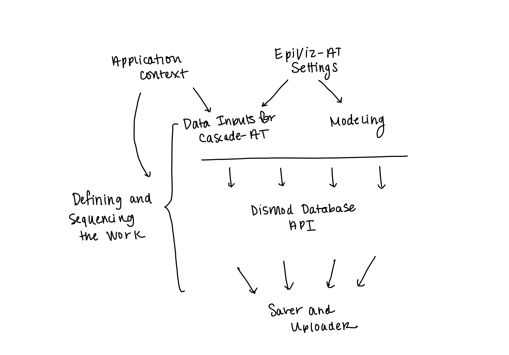

.. _module-docs:

Module Documentation
====================

This is the documentation for each of the modules
in the ``cascade-at`` package. Here is an overview for how
all of the modules fit together:

.. toctree::
   :maxdepth: 1

   executor/index
   settings/index
   inputs/index
   model/index
   dismod/index
   core/index
   context/index
   saver/index

