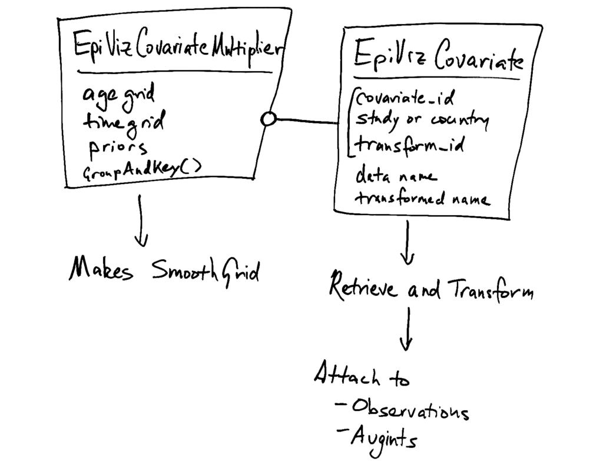

.. _covariates:

Covariates
^^^^^^^^^^

Covariates Design from EpiViz
"""""""""""""""""""""""""""""

EpiViz-AT classifies covariates as country and study types.
The country are 0 or 1 and are specific to the bundle. The country
are floating-point values defined for every age / location / sex / year.

The strategy for parsing these and putting them into the model is to
split the data download and normalization from construction of model priors.
The :py:class:`~cascade_at.inputs.utilities.covariate_specifications.EpiVizCovariate` is the information part.
The :py:class:`~cascade_at.inputs.utilities.covariate_specifications.EpiVizCovariateMultiplier` is the model prior part.

For reading data, the main complication is that covariates have several IDs
and names.

 *  ``study_covariate_id`` and ``country_covariate_id`` may be equal for
    different covariates. That is, they are two sets of IDs. We have no
    guarantee this is not the case (even if someone tells us it is not the case).

 *  In the inputs, each covariate has a ``short_name``, which is what we use.
    The short name, in other inputs, can contain spaces. I don't know that
    study and country short names are guaranteed to be distinct. Therefore...

 *  We prefix study and country covariates with ``s_`` and ``c_``.

 *  Covariates are often transformed into log space, exponential space,
    or others. These get ``_log``, ``_exp``, or whatever appended.

 *  When covariates are put into the model, they have English names,
    but inside Dismod-AT, they get renamed to ``x_0``, ``x_1``, ``x_...``.

.. automodule:: cascade_at.inputs.utilities.covariate_specifications
   :members:
   :undoc-members:
   :show-inheritance:

The following class is a wrapper around the covariate
specifications that makes them easier to work with and
provides helpful metadata.

.. automodule:: cascade_at.inputs.covariate_specs
   :members:
   :undoc-members:
   :show-inheritance:

Definition of Study and Country
"""""""""""""""""""""""""""""""

There are three reasons to use a covariate.

*Country Covariate*
    We believe this covariate predicts disease behavior.

*Study Covariate*
    **THIS IS DEPRECATED**: the only study covariates
    are sex and one, described below.

    The covariate marks a set of studies that behave differently.
    For instance, different sets of measurements may have different
    criteria for when a person is said to have the disease.
    We assign a covariate to the set of studies
    to account for bias from study design.

*Sex Covariate*
    This is usually used to select a subset of data by sex,
    but this could be done based on any covariate associated
    with observation data. In addition to being used to subset
    data, the sex covariate is a covariate multiplier applied
    the same way as a study covariate.

*One Covariate*
    The "one covariate" is a covariate of all ones. It's treated within
    the bundle management system as a study covariate. It's used
    as a covariate on measurement standard deviations, in order to
    account for between-study heterogeneity. A paper that might be
    a jumping-off point for understanding this is [Serghiou2019]_.

A covariate column that is used just for exclusion doesn't need
a covariate multiplier. In practice, the sex covariate is used
at global or super-region level as a study covariate. Then the
adjustments determined at the upper level are applied as constraints
down the hierarchy. This means there is a covariate multiplier
for sex, and its smooth is a grid of constraints, not typical
priors.

Dismod-AT applies covariate effects to one of three different variables.
It either uses the covariate to `predict the underlying rate`_,
or it applies the covariate to predict the measured data. It can
be an effect on either the `measured data value`_ or the
observation data `standard deviation`_. Dismod-AT calls these, respectively,
the alpha, beta, and gamma covariates.

As a rule of thumb, the three uses of covariates apply
to different variables, as shown in the table below.

====================  =======  ================ ===============
Use of Covariate      Rate     Measured Value   Measured Stddev
====================  =======  ================ ===============
Country               Yes      Maybe            Maybe
Study                 Maybe    Yes              Yes
Sex (exclusion)       No       Yes              No
====================  =======  ================ ===============

Country and study covariates can optionally use outliering.
The sex covariate is defined by its use of regular outliering.
Male and female data is assigned a value of -0.5 and 0.5, and
the mean and maximum difference are adjusted to include one,
the other, or both sexes.

.. _study-country-policies:

Policies for Study and Country Covariates
"""""""""""""""""""""""""""""""""""""""""

 *  Sex is added as a covariate called ``s_sex``, which Dismod-AT
    translates to ``x_0`` for its db file format. It is -0.5 for women,
    0.5 for men, and 0 for both or neither. This covariate is used to
    exclude data by setting a reference value equal to -0.5 or 0.5 and
    a max allowed difference to 0.75, so that the "both" category is
    included and the other sex is excluded.

 *  The ``s_one`` covariate is a study covariate of ones. This can be
    selected in the user interface and is usually used as a gamma covariate,
    meaning it is a covariate multiplier on the standard deviation of
    measurement data. Its covariate id is 1604, and it appears in the db
    file as ``x_1`` with a reference value of 0 and no max difference.

.. _predict the underlying rate:
    https://bradbell.github.io/dismod_at/doc/avg_integrand.htm#Rate%20Functions.Rate%20Covariate%20Multiplier,%20alpha_jk

.. _measured data value:
    https://bradbell.github.io/dismod_at/doc/avg_integrand.htm#Measurement%20Value%20Covariates.Multiplier,%20beta_j

.. _standard deviation:
    https://bradbell.github.io/dismod_at/doc/data_like.htm#Measurement%20Standard%20Deviation%20Covariates.gamma_j

.. [Serghiou2019] Serghiou, Stylianos, and Steven N. Goodman.
   "Random-Effects Meta-analysis: Summarizing Evidence With Caveats."
   Jama 321.3 (2019): 301-302.

Country Covariate Data
""""""""""""""""""""""

To grab the data for the covariates, we use this class that is part of the
core data inputs.

.. autoclass:: cascade_at.inputs.covariate_data.CovariateData
   :members:
   :undoc-members:
   :show-inheritance:

Because study covariates are deprecated, we don't need to get data for those.
Instead, in the :py:class:`~cascade_at.inputs.measurement_inputs.MeasurementInputs`
class we just assign the sex and one covariate values on the fly.

Covariate Interpolation
"""""""""""""""""""""""

When we attach covariate values to data points, we often need to interpolate
across ages or times because the data points don't fit nicely into the covariate
age and time groups that come from the GBD database.

The interpolation happens inside of
:py:class:`~cascade_at.inputs.measurement_inputs.MeasurementInputs`,
using the following function that creates a
:py:class:`~cascade_at.inputs.utilities.covariate_weighting.CovariateInterpolator`
for each covariate.

.. autofunction:: cascade_at.inputs.utilities.covariate_weighting.get_interpolated_covariate_values

.. autoclass:: cascade_at.inputs.utilities.covariate_weighting.CovariateInterpolator
   :members:
   :undoc-members:
   :show-inheritance:

