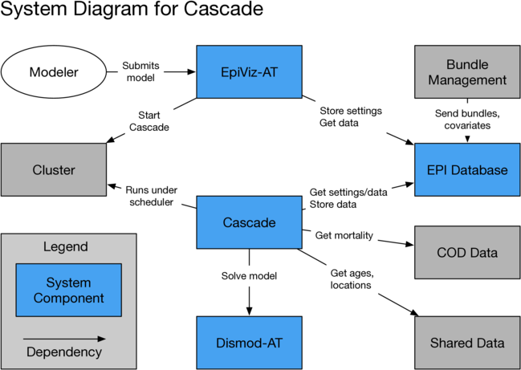
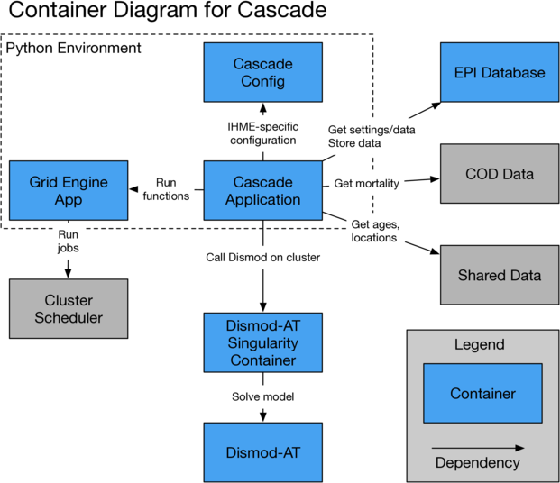
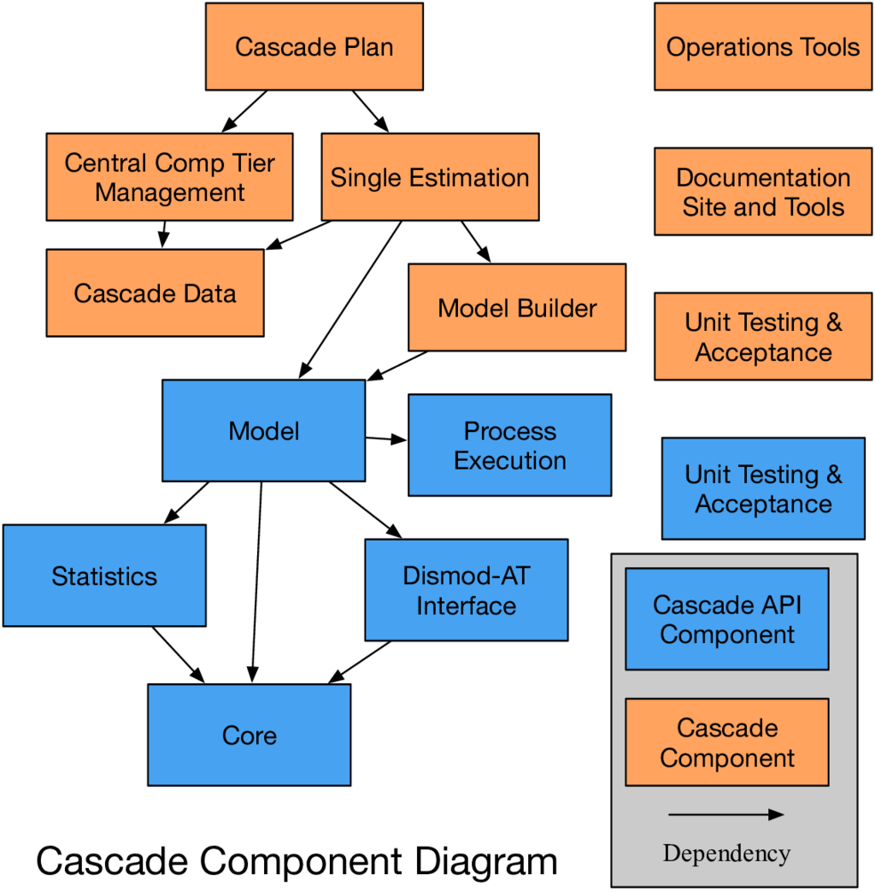
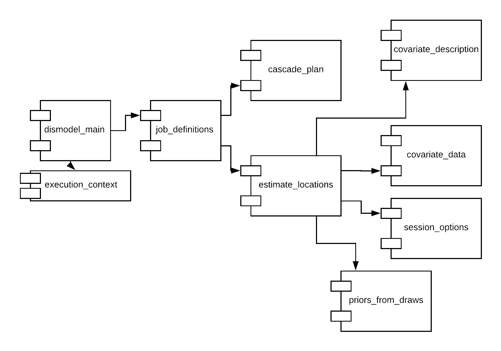

.. _cascade-architecture:

Architecture Diagrams
=====================

These diagrams follow the `C4 Model <c4model.org>`_ as best they
can. They start from a global view and zoom in.

System Diagram
--------------
This shows the application, as a whole, in relation to its
collaborators. The challenge here is that the application,
as a user understands it, has many more parts than the modeling
code.

Each system is described here:

 * **Modeler** is a person who creates a model and examines results
   from running that model.

 * **EpiViz-AT** is a web form, written in JavaScript, that both
   lets the modeler describe the model and shows results from the
   model fit.

 * **Bundle Management** is a set of tools from Central Comp
   used to describe the main data used for this particular
   disease. This is hospital data, or survey data, or other
   data sources. They are curated and placed into the EPI
   database.

 * **EPI database** is the main hub through which all data
   moves. It has tables written by EpiViz-AT, the bundle
   management, and the Cascade.

 * **COD data** is cause-of-death data. This provides
   age-specific death rate, due to all causes of death,
   and it provides cause-specific death rate, due to the
   disease under study.

 * **Shared data** defines the ages, times, locations,
   and years over which the model applies.

 * **Cascade** is a Python virtual environment containing
   separate installed packages, described below.

 * **Dismod-AT** is an installation of the
   Dismod-AT application, within a container, on the cluster.

 * **Cluster** is the local cluster and scheduler, which
   runs the jobs.

In addition to this diagram above, there are other tools
required for management of bundles by modelers, as part
of using the Cascade.

 * There is a command-line interface
   to the Cascade, used by both modelers and operations
   staff. This is in the cluster's code directory, under
   ``dismod_at/bin``. Inside that directory is a custom
   version of the Elmo repository that we hacked to work
   for our data.

 * A `Cascade Validation Service <https://github.com/ihmeuw/cascade_validation_service>`_
   is a web service that responds to requests from the EpiViz-AT
   user interface to validate the settings before submitting
   the cluster job. That web service is written but not deployed.

Container Diagram
-----------------

Zoom in on the Cascade and installation of Dismod-AT
to see containers, which the C4 model describes as
anything separately-installed.

There are three separate repositories of
Python code installed into a single Python
virtual environment on the cluster.

 * **Cascade Config** - This repository is called
   ``cascade_config`` and is behind the IHME firewall.
   It contains parameters that have file paths.
   The Cascade uses setuptools and ``pkg_resources``
   in order to find this configuration.

 * **Grid Engine App** - The logic to run the
   Cascade is complicated by requirements to run it locally
   in a debug mode and as multiple processes, for
   the authors of Dismod-AT to do debugging. This repository,
   at `gridengineapp <https://github.com/ihmeuw/gridengineapp>`_,
   encapsulates that capability, along with the core ability
   to run on the cluster.

 * **Cascade** - This is the main Python code, in the repository
   `Cascade <https://github.com/ihmeuw/cascade>`_.

 * **Epi Database** - This is a MySQL database, just for
   the Dismod-AT work.

 * **Dismod-AT Singularity** - This is described by a Dockerfile
   that is installed into a repository called `dismod` under
   the containers section of the IHME versioning system.

 * **Dismod-AT** - On Github at
   `Dismod-AT <https://github.com/bradbell/dismod_at>`_.
   This code contains its own Dockerfile.

Missing from this container diagram is that there are scripts
installed on the cluster that are called by EpiViz-AT
in order to launch Cascade jobs. These are on the EPI section
of the filesystem. There is also a separate installation
of a tool called Elmo, alongside the Cascade. That exists
because Elmo wasn't written to handle Dismod-AT, and modelers
sometimes need to modify and re-upload bundles.

Component Diagram
-----------------

The component diagram looks inside the Cascade
source code. This diagram outlines major parts of
the code. This diagram says one thing clearly:
the Cascade application relies on the Cascade API,
and the two are separate.

The list of components, however, does not match
the code well. I didn't know how to fit them.
The code is arranged on disk so that each subdirectory
should be treated as a separate component.

 * **How Parameters Change through Model Hierarchy** - This
   is in the ``cascade.executor`` module and is
   the Cascade Plan.

 * **Graph of Recipes to Run** - The graph is defined
   in ``cascade.runner`` and populated in the ``cascade.executor``
   component.

 * **Read and Write Data to External Databases** - This
   is the ``cascade.input_data`` component.

 * **Build a model given parameters** - This is the rest
   of the work in ``cascade.executor``.

 * **Model** is ``cascade.model``. It defines a data structure.
   If you fill out the data structure, then it will write
   correctly and read from the Dismod-AT db file.

 * **Process execution** - This is in ``cascade.dismod``
   and is the set of rules for how to know when Dismod-AT
   ran without error. This turns out to be complicated.

 * **Dismod-AT interface** - This is also in ``cascade.dismod``
   and defines the Dismod db file structure.

 * **Statistics** - A minor bit of statistics used to
   massage data to Dismod-AT.

 * **Core** - Tools to handle parameters, processes,
   and logging, used by all other components.

The Executor Component
----------------------

This looks at dependencies within the ``cascade.executor`` component.

There are four separate applications in this component.

 1. ``dismodel``, which is the main application,
    with an entry point in ``dismodel_main.py``.

 2. ``dmres2csv``, which retrieves residuals from a db file,
    in ``model_residuals_main.py``.

 3. ``dmr2csv``, which retrieves results from a db file,
    in ``model_results_main.py``.

 4. ``dmgetsettings``, which downloads settings from the Epi
    database to a file, which ``dismodel`` can then read,
    in ``epiviz_json.py``.

If we look just at the ``dismodel`` application, the relationship
among the modules is shown below.

To summarize the relationships,

 1. ``dismodel_main`` is the application, written for the
    Gridengineapp framework.

 2. It uses an ``execution_context`` to describe whether it
    is running on a local computer or within a cluster.

 3. The application creates a job graph, where both the
    graph and all of the job objects are defined in
    the ``job_definitions``.

 4. Each job is configured using a settings decided in
    ``cascade_plan``. The idea is that any decision phrased
    as "at this level of the hierarchy, do X, and at other levels,
    do Y" gets translated
    by the Cascade Plan into "this job, given what we know about
    it, will do X."

 5. Most of the work to retrieve data, fit, and summarize,
    is in ``estimate_locations.`` These functions mostly
    collaborate with the ``cascade.model`` component,
    but they have a few helpers in executors.

 6. The construction of covariates has two helpers, ``covariate_description``
    to define what the covariates are, and
    ``covariate_data`` to do interpolation of covariates.

 7. ``session_options`` sets options for Dismod-AT's options
    table.

 8. ``priors_from_draws`` is a separate module that reads the
    results of a location's estimation and makes data for child
    estimations to use as input as a kind of bootstrapping.
