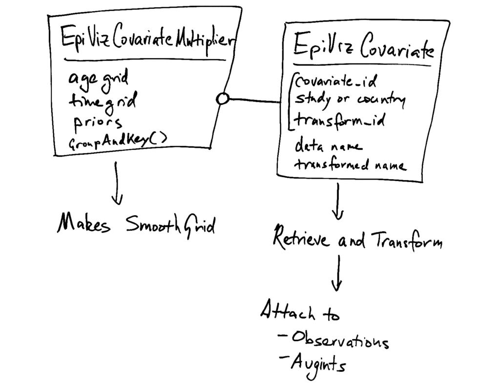

.. _covariate_design:

Covariate Design
================

EpiViz-AT classifies covariates as country and study types.
The country are 0 or 1 and are specific to the bundle. The country
are floating-point values defined for every age / location / sex / year.

The strategy for parsing these and putting them into the model is to
split the data download and normalization from construction of model priors.
The :py:class:`EpiVizCovariate <cascade.executor.covariate_description.EpiVizCovariate>` is the
The :py:class:`EpiVizCovariateMultiplier <cascade.executor.covariate_description.EpiVizCovariateMultiplier>` is the model prior part.

For reading data, the main complication is that covariates have several IDs
and names.

 *  ``study_covariate_id`` and ``country_covariate_id`` may be equal for
    different covariates. That is, they are two sets of IDs. We have no
    guarantee this is not the case (even if someone tells us it is not the case).

 *  In the inputs, each covariate has a ``short_name``, which is what we use.
    The short name, in other inputs, can contain spaces. I don't know that
    study and country short names are guaranteed to be distinct. Therefore...

 *  We prefix study and country covariates with ``s_`` and ``c_``.

 *  Covariates are often transformed into log space, exponential space,
    or others. These get ``_log``, ``_exp``, or whatever appended.

 *  When covariates are put into the model, they have English names,
    but inside Dismdod-AT, they get renamed to ``x_0``, ``x_1``, ``x_...``.

Testing study covariate data requires that the ``seq`` matches in covariates
and bundle, so there is a :py:module:``cascade.testing_utilities.fake_data``
module. The main test, however, is in ``test_estimate_locations.py``.
