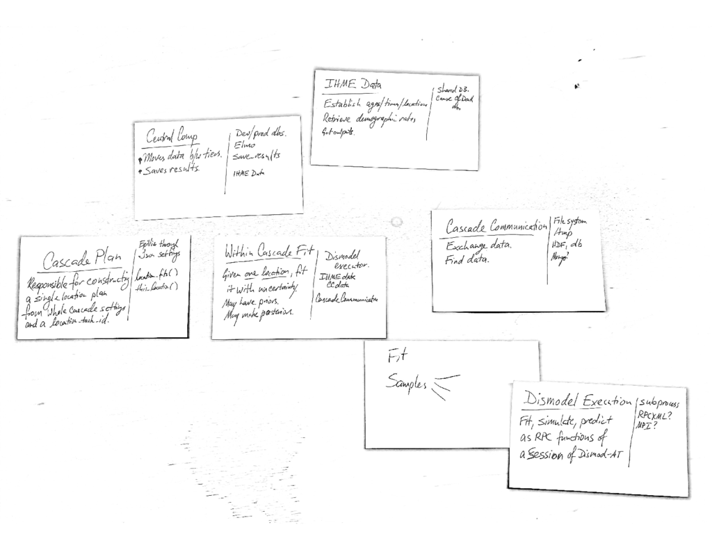

.. _design-sketches:

Design Sketches
===============

Component Diagram
^^^^^^^^^^^^^^^^^

For this software, a component is a top-level package in Python.
Each box in this diagram corresponds to something like
``cascade.model`` or ``cascade.executor``.

.. image:: cascade_components.png
    :scale: 50

There are two separate installations for the Cascade, the
Cascade API which creates a Python interface for Dismod-AT,
and the Cascade, which is an application that uses that interface
to create a global Illness-Death model.

Main Sketch
^^^^^^^^^^^

These are CRC cards for rewriting the ``main()``.
