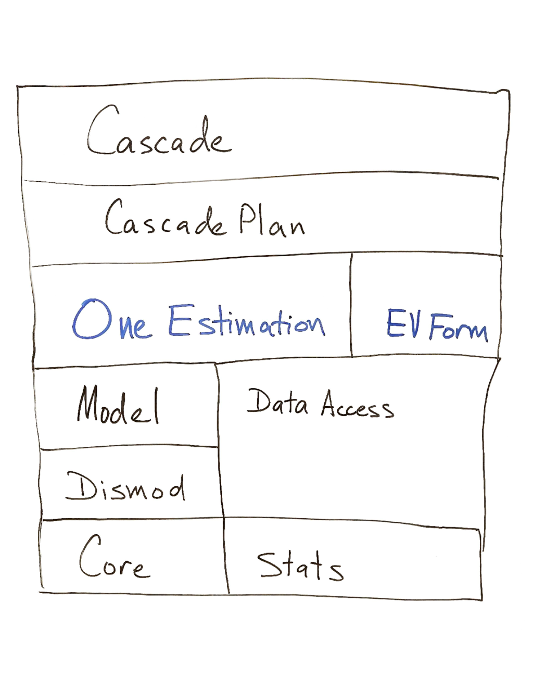

.. _parameter-plans:

Parameter-Handling Plans
========================

We label some variables parameters because they are immutable within
a function and the functions it calls. These values need higher visibility
than functions in local scope because they represent policies within the
code. Their immutability also makes it relatively forgivable to violate
typical scoping rules, for instance by making parameters available
as globals.

This section asks how we should use parameters within the EpiViz-AT Main()
executable and within the larger Cascade project. The project, itself,
has distinct layers, represented by Python namespace packages, so they are

 * ``cascade.executor`` - The EpiViz-AT main.
 * ``cascade.input_data`` - Inputs (and outputs should be here) to IHME databases.
 * ``cascade.model`` - Our object-oriented representation of the statistical model.
 * ``cascade.dismod`` - A thinner wrapper around Dismod-AT.
 * ``cascade.core`` - Functionality used by the other packages.
 * ``cascade.stats`` - Pure statistical functions.

As layers, they look like the following, where those in blue are where
I propose using parameter containers of different kinds.

The EpiViz-AT Form is working very well to capture settings.
The CascadePlan creates a location-specific set of parameters, so that
there is no logic in the single estimation that concerns where something
is within the hierarchy. All of that logic is handled in the Cascade Plan.

I suggest that the Model, Dismod, and even Data Access namespace packages
shouldn't use the parameters. Just the One Estimation part.

What are the use-cases?

 1. Construct parameters for one location (specific to a single estimation).
 2. Make parameters as a testing fixture.
 3. Find and use parameters within construction of a Model.
 4. Serialize and de-serialize parameters for one location.

Nice-to-haves:

 * Know which parameters were read or unread.
 * Freeze parameters within the scope where they are treated as parameters.
 * Have strict typing for parameters.
 * Have a description for each parameter.
 * Store them hierarchically.
 * Access all parameters within "your" section of the hierarchy.
 * Difference between parameters sets.
 * Dot access with tab-completion.

The Cascade Plancan transform settings into an internal representation of
parameters. Why transform it?

 * So that the settings names can vary without affecting internal code.
 * So that we can find parameters. They are disorganized in the setings.

Those reasons aren't super-strong. Meet the use cases. That's what we
need to do.

We have the following at our disposal.

 *  *Configuration* - Validates and presents the EpiViz-AT form.
 *  *Settings file* - Stores typed parameters with descriptions.
 *  *Args* - Argparse output used to initialize some parameters.
 *  *Policies* - A sub-section of configuration we use to store settings.
 *  *Python dataclasses* - Basically a struct.
 *  *Parameters module* - It's like the logging module, but for parameters.
