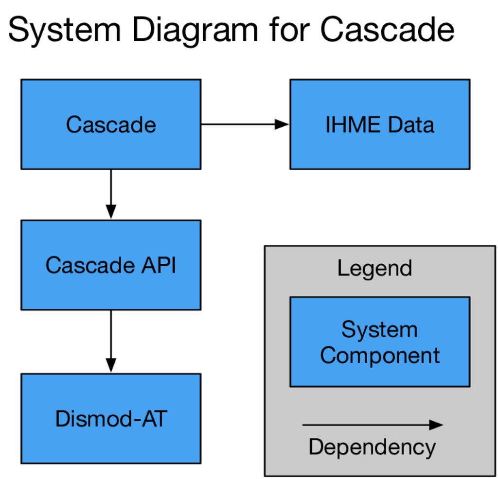

.. _overview-of-epiviz:

Overview of Cascade
===================

EpiViz-AT
^^^^^^^^^

EpiViz-AT is a web page on http://internal.ihme.washington.edu/epi-at/.
After you fill out
that web page and hit submit, the web server runs a program on the cluster.
We call that program ``dmcascade``. It is installed on the IHME cluster,
and the code itself is stored at https://github.com/ihmeuw/cascade.
This documentation, that you're reading, is at https://cascade.readthedocs.io.

System Diagram
^^^^^^^^^^^^^^
The Cascade is composed of several systems, some of which are shown in
this partial diagram:

EpiViz-AT
    is the webpage where you define a model version, submit the job to the cluster and view results.

Cascade-AT
    estimates incidence, prevalence and mortality rates for a single
    disease for every country or district in the world from the sum
    of all available disease and death observations in all countries.
    
DisMod-AT
    enables a public health scientist to model the rate at which we
    get a condition, recover from a condition, die from a condition
    and die from other causes. It is called Dismod-AT because the
    condition is often a disease and it is used to model the rates
    as stochastic functions of age and time.

The `User Manual <user-manual>`_ covers the Cascade API and its
:ref:`dismod-description` is the best
spot to learn about the underlying statistical model.
All detailed questions about Dismod-AT are in the
`online Dismod-AT documentation <https://bradbell.github.io/dismod_at/doc/dismod_at.htm>`_.

Documentation Layout
^^^^^^^^^^^^^^^^^^^^

 *  Global Model - Background for how the hierarchy of locations fits together.
 *  Cascade Plan - decides what to do at each level of the location hierarchy.
 *  EpiViz-AT Inputs - describes input data and transformations to that data.
 *  EpiViz-AT Outputs - describes output data and transformations to that data.
 *  Model Building - How the Cascade uses EpiViz-AT settings and the Cascade API.
 *  Command-line tools - Executable applications on the cluster, including :ref:`dmcascade-command-line`
 *  Operations and Maintenance - Processes to manage the Cascade.
