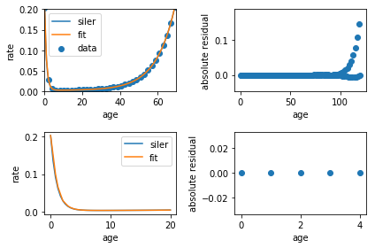

Fit Tutorial
============

Demonstrates performing a fit to a single-parameter model. This
generates a synthetic mortality rate and then fits that mortality.

The first step is to load all the libraries. This requires having all of
these libraries installed, including both Cascade and Dismod-AT in a
Docker container.

.. code:: python

    import matplotlib
    import numpy as np
    import matplotlib.pyplot as plt
    %matplotlib inline
    import matplotlib.gridspec as gridspec
    from math import nan, inf
    from pathlib import Path
    import numpy as np
    import pandas as pd
    import pytest
    
    import matplotlib.pyplot as plt
    # Make the plots bigger.
    plt.rcParams['figure.figsize'] = [10, 8]
    
    # These are all of the classes we need from Cascade-AT.
    from cascade.model import (
        Session, Model, DismodGroups, SmoothGrid, Var, Covariate,
        Uniform, Gaussian
    )
    from cascade.stats.compartmental import siler_default, total_mortality_solution

.. code:: python

    # Use Siler mortality as our known true. This is a function of age,
    # as presented, but it's defined over ages and times.
    mortality = siler_default()
    print(f"Mortality as a function of age, "
          f"at 0 {mortality(0):.4f} and at 20 {mortality(20):.4f}")

.. parsed-literal::

    Mortality as a function of age, at 0 0.2032 and at 20 0.0045

Dismod-AT is a random effects model where the micro-level is the data
and the macro-level is the location where that data was observed.
Dismod-AT assumes the locations form a hierarchy and that, for any fit
or predict, there is one parent location. All data measured within the
children of that parent location will be included in the fit.

Specify locations as a Pandas DataFrame with columns for the name,
location id as an integer, and the parent location as an integer. The
name is purely cosmetic.

.. code:: python

    parent_location = 1
    locations = pd.DataFrame(dict(
        name=["global"],
        parent_id=[nan],
        location_id=[parent_location],
    ))

Make Data Using Dismod-AT Predict
---------------------------------

The siler distribution is the theoretically-known rate. Use the
Dismod-AT predict function to create integrands such as prevalence,
with-condition, or mtother, from this base rate.

The input to Dismod-AT Predict is a representation of a continuous rate
as an interpolation on a grid. Make a grid that has yearly age points
and is defined for one year in time. The way Dismod-AT handles
interpolation, all times outside the bounds of the grid points are
constant at the nearest grid point value, so this means the rate is
constant in time across all times, but still varies by age.

.. code:: python

    age_points = 121
    omega = Var(np.linspace(0, 120, age_points), [2000])
    for age, time in omega.age_time():
        omega[age, time] = mortality(age)

While this model has only one rate, Dismod-AT models can have five
rates. We put this rate into a larger structure, called a
``DismodGroups``, so that it knows which rate we're giving it.

.. code:: python

    model_variables = DismodGroups()
    model_variables.rate["omega"] = omega

Dismod-AT predict calculates values of integrands at different ages and
times. We need to tell it what we want it to calculate. This looks a lot
like how we specify data to a Dismod-AT fit. This example asks for the
fraction of susceptibles and for mtother, which should be exactly the
rate we put in as omega, given that the lower and upper ages are the
same and lower and upper times are the same.

.. code:: python

    data_cnt = 60
    susceptibles = pd.DataFrame(dict(
        integrand="susceptible",
        location=parent_location,
        age_lower=np.linspace(0, 120, data_cnt),
        age_upper=np.linspace(0, 120, data_cnt),
        time_lower=2000,
        time_upper=2000,
    ))
    mtother = pd.DataFrame(dict(
        integrand="mtother",
        location=parent_location,
        age_lower=np.linspace(0, 120, data_cnt),
        age_upper=np.linspace(0, 120, data_cnt),
        time_lower=2000,
        time_upper=2000,
    ))
    avgints = pd.concat([susceptibles, mtother])

Those are the inputs for running Dismod-AT predict. The next step is to
start a Dismod-AT session and run predict. A Dismod-AT session
communicates with Dismod-AT running underneath.

.. code:: python

    session = Session(locations, parent_location, Path("fit0.db"))
    session.set_option(ode_step_size=1)

Note the ``ode_step_size=1``. This is the resolution with which predict
integrates the function. It's generally good to have the input grid and
step size be about the same size. We can play with this to understand
how step size affects fit accuracy, because a Dismod-AT fit is built
upon running predict over and over again during optimization.

Prediction returns two sets of data, the data points requested and those
that *could not be predicted* because they were associated with
covariates that are outliered. No such covariates are in this model, so
that list will be empty.

.. code:: python

    predicted, not_predicted = session.predict(model_variables, avgints, parent_location)
    assert not_predicted.empty and not predicted.empty
    print(f"Predicted outcome with columns {', '.join(str(pc) for pc in predicted.columns)}")

.. parsed-literal::

    Predicted outcome with columns sample_index, mean, location, integrand, age_lower, age_upper, time_lower, time_upper

The predictions are a Pandas DataFrame with the columns shown. They will
match the avgints, so there are two sets of outcomes in this case,
mtother and susceptibles. This is now our data.

Let's fit that data. This entails making a Model and setting its priors.

.. code:: python

    nonzero_rates = ["omega"]
    model = Model(nonzero_rates, parent_location)
    model.rate["omega"] = SmoothGrid(np.linspace(0, 120, age_points), [2000])
    for a, t, dage, dtime in model.rate["omega"].age_time_diff():
            target = omega(a, t)
            model.rate["omega"].value[a, t] = Uniform(mean=target, upper=target + 5, lower=0)
            model.rate["omega"].dage[a, t] = Gaussian(mean=0, standard_deviation=50, lower=-5, upper=5)
            model.rate["omega"].dtime[a, t] = Gaussian(mean=0, standard_deviation=0.1, lower=-5, upper=5)

That's the whole model. We could set the standard deviation on the
age-difference priors from the forward age difference if we wanted, but
it's enough to let them have a very large standard deviation.

While that was 8 lines, the output of predict needs some help to look
like input data.

The predicted values are a single trajectory, a single answer. Input
data has a single mean value, but it needs to have uncertainty. The
second line below assigns an uncertainty to each line of the data.

.. code:: python

    data = predicted.drop(columns=["sample_index"])
    # This adds an uncertainty to every data value.
    data = data.assign(density="gaussian", std=0.3, eta=1e-4, nu=nan)
    
    # It doesn't matter when the times are, because the the grid for this
    # rate has only one time point. That makes it constant across ages and times.
    data.loc[:, "time_lower"] = np.random.randint(1990, 2015, size=len(data))
    # We can add some range to ages and times if we want.
    add_some_range_to_times = 0
    add_size = add_some_range_to_times * np.random.random(size=len(data))
    data.loc[:, "time_upper"] = data.loc[:, "time_lower"] + add_size
    
    # Want to intentionally take a data range and make it wrong?
    mess_factor = 1  # 1 means leave it alone.
    data.loc[(data.age_lower > 20) & (data.age_lower < 40) & (data.integrand == "mtother"), "mean"] = \
        mess_factor * data.loc[(data.age_lower > 20) & (data.age_lower < 40), "mean"]

That's all the parts for a fit: model with priors and data.

.. code:: python

    result = session.fit(model, data, initial_guess=model_variables)
    fit_omega = result.fit.rate["omega"]

The resulting fit contains several parts.

-  ``fit`` - This has the same structure as the ``model_variables``
   above.
-  ``prior_residuals`` - These are residuals and lagrange values for all
   priors.
-  ``data_residuals`` - Residuals on the input data uncertainty.
-  ``fit_data`` - The data that was included in the fit.
-  ``excluded_data`` - Which data was excluded from the fit, due to
   being held out or having covariates that are outliered.

The value residuals should be small, unless we intentionally skewed the
other-cause mortality with ``mess_factor``.

.. code:: python

    value_residuals = list()
    for age, time in fit_omega.age_time():
        value_residuals.append([age, float(fit_omega[age, time] - omega[age, time])])
    # Makes an age column and a time column.
    value_residuals = np.array(value_residuals).T

.. code:: python

    def plot_mortality(continuous_mortality, result, data, value_residuals):
        fig = plt.figure(tight_layout=True)
        gs = gridspec.GridSpec(2, 2)
    
        ax = fig.add_subplot(gs[0, 0])
        x = np.linspace(0, 120, 241)
        slabel, = ax.plot(x, continuous_mortality(x), label="siler")
        omega_fit = result.fit.rate["omega"]
        flabel, = ax.plot(x, omega_fit(x, 2000), label="fit")
        mtother_data = data[data.integrand == "mtother"]
        dlabel = ax.scatter(mtother_data.age_lower.values, mtother_data["mean"].values, label="data")
        ax.legend(handles=[slabel, flabel, dlabel])
        ax.set_xlim([0, 70])
        ax.set_ylim([0, .2])
        ax.set_xlabel("age")
        ax.set_ylabel("rate")
    
        ax01 = fig.add_subplot(gs[0, 1])
        ax01.scatter(value_residuals[0], value_residuals[1])
        ax01.set_xlabel("age")
        ax01.set_ylabel("absolute residual")
    
        ax10 = fig.add_subplot(gs[1, 0])
        xkids = np.linspace(0, 20, 50)
        slabel, = ax10.plot(xkids, mortality(xkids), label="siler")
        # olabel, = ax10.plot(xkids, omega(xkids, 2000), label="omega")
        omega_fit = result.fit.rate["omega"]
        flabel, = ax10.plot(xkids, omega_fit(xkids, 2000), label="fit")
        ax10.legend(handles=[slabel, flabel])
        # ax.set_xlim([0, 70])
        # ax.set_ylim([0, .2])
        ax10.set_xlabel("age")
        ax10.set_ylabel("rate")
    
        ax11 = fig.add_subplot(gs[1, 1])
        ax11.scatter(value_residuals[0][:5], value_residuals[1][:5])
        ax11.set_xlabel("age")
        ax11.set_ylabel("absolute residual")
    
        plt.show()

.. code:: python

    plot_mortality(mortality, result, data, value_residuals)

